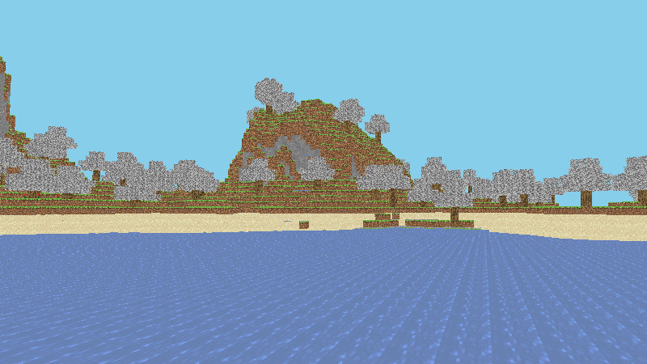

# Custom Minecraft Client
Made for education purposes only

## Plans
* [x] Connected to offline-mode server
* [x] Retrieve necessary packets to load a world
* [ ] Render world
    * [ ] Load model from vanilla resource pack
        * [x] Load basic JSON models
        * [ ] Load variant-based models
            * [ ] Use model cullfaces
            * [ ] Load model rotations
            * [x] Load model faces
            * [x] Load model textures
        * [ ] Load multipart models
    * [x] Render Chunks
    * [ ] Optimize rendering

## Non-goals
* Cheats
* Access to servers without an account
* Single player
* Mod support

Last screenshot:
